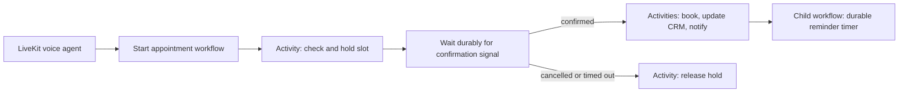

# Temporal Auto Receptionist

This is a small migration of the scheduling portion of the **Graham Auto Receptionist** realtime voice agent demo. The voice agent application gives a real-time voice experience; this project hardens the appointment lifecycle behind it using Temporal.

**Companion voice application:** [Graham Auto Receptionist](https://github.com/GrahamMcBain/graham-auto-receptionist)

> AI makes it easy to build compelling prototypes quickly. Temporal helps turn those prototypes into dependable systems that can safely perform real customer work.

## The original demo

The original receptionist used a synchronous, in-memory `SchedulingService`. It could check availability and create an appointment during one happy-path conversation, but it had predictable prototype limitations:

- A restart lost all appointment state.
- A caller's confirmation existed only in the active conversation.
- Calendar, CRM, and notification failures had no durable retry path.
- Concurrent callers could race for the same slot.
- There was no reliable way to schedule a future reminder.

The original shape is preserved in [`src/before/scheduling-service.ts`](src/before/scheduling-service.ts).

## What is temporalized

The voice agent remains the real-time conversation layer. Once it has collected appointment details, it starts one Temporal workflow per requested appointment.

`src/workflows/appointment.ts` contains two Workflows:

- `appointmentWorkflow` owns the booking lifecycle. It holds a requested slot, receives confirmation or cancellation Signals, times out after 15 minutes, and invokes side-effecting Activities with retries.
- `appointmentReminderWorkflow` sleeps for 24 hours and sends a reminder. The timer is durable rather than relying on a process-local `setTimeout`.

`src/activities/appointment.ts` is the integration boundary. The included implementations are intentionally small in-memory stand-ins; in a production integration, these Activities would call a database-backed calendar, CRM, and notification provider. The appointment-creation Activity uses the Workflow ID as its idempotency key.

## Why the split matters

| Concern | LiveKit | Temporal |
|---|---|---|
| Real-time microphone/audio transport | Yes | No |
| Speech-to-text, LLM, and text-to-speech | Yes | No |
| Durable business-process state | No | Yes |
| Waiting for a customer response across a restart | No | Yes |
| Retrying external calendar/CRM calls | Manual | Configured Activity retries |
| Durable timers and reminders | Manual | Yes |

Temporal does **not** replace the calendar or CRM database. It records and resumes the process; Activities still own side effects and should use normal transactional and uniqueness protections in their downstream systems.

## Try the live demo

### [Try the voice agent here](https://graham-auto-receptionist.vercel.app/)

## Deliberate trade-offs

- The confirmation hold is 15 minutes for demonstration. A real shop would choose the duration based on its booking policy.
- The repository uses in-memory Activity fakes to keep the sample self-contained. That is not a claim that Temporal is a database.
- Rescheduling and staff escalation are natural follow-on Workflows or Signals, but the sample concentrates on one complete booking lifecycle rather than becoming a full shop-management system.
