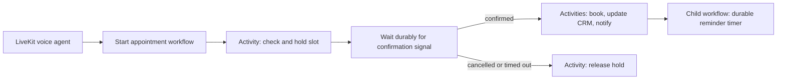

# Temporal Auto Receptionist

This is a small migration of the scheduling portion of the **Graham Auto Receptionist** realtime voice agent demo. The voice agent application gives a real-time voice experience; this project hardens the appointment lifecycle behind it using Temporal.

**Companion voice application:** [Graham Auto Receptionist](https://github.com/GrahamMcBain/graham-auto-receptionist)

> AI makes it easy to build compelling prototypes quickly. Temporal helps turn those prototypes into dependable systems that can safely perform real customer work.

## The original demo

The original receptionist used a synchronous, in-memory `SchedulingService`. It could check availability and create an appointment during one happy-path conversation, but it had predictable prototype limitations:

- A restart lost all appointment state.
- A caller's confirmation existed only in the active conversation.
- Calendar, CRM, and notification failures had no durable retry path.
- Concurrent callers could race for the same slot.
- There was no reliable way to schedule a future reminder.

The original shape is preserved in [`src/before/scheduling-service.ts`](src/before/scheduling-service.ts).

## What is temporalized

The voice agent remains the real-time conversation layer. Once it has collected appointment details, it starts one Temporal workflow per requested appointment.



`src/workflows/appointment.ts` contains two Workflows:

- `appointmentWorkflow` owns the booking lifecycle. It holds a requested slot, receives confirmation or cancellation Signals, times out after 15 minutes, and invokes side-effecting Activities with retries.
- `appointmentReminderWorkflow` sleeps for 24 hours and sends a reminder. The timer is durable rather than relying on a process-local `setTimeout`.

`src/activities/appointment.ts` is the integration boundary. The included implementations are intentionally small in-memory stand-ins; in a production integration, these Activities would call a database-backed calendar, CRM, and notification provider. The appointment-creation Activity uses the Workflow ID as its idempotency key.

## Why the split matters

| Concern | LiveKit | Temporal |
|---|---|---|
| Real-time microphone/audio transport | Yes | No |
| Speech-to-text, LLM, and text-to-speech | Yes | No |
| Durable business-process state | No | Yes |
| Waiting for a customer response across a restart | No | Yes |
| Retrying external calendar/CRM calls | Manual | Configured Activity retries |
| Durable timers and reminders | Manual | Yes |

Temporal does **not** replace the calendar or CRM database. It records and resumes the process; Activities still own side effects and should use normal transactional and uniqueness protections in their downstream systems.

## Run it locally

This project needs a local Temporal development server or a configured Temporal Cloud connection.

```bash
npm install
temporal server start-dev
npm run dev:worker
npm run demo
```

The demo starts an appointment Workflow and sends the confirmation Signal, mirroring the signal a LiveKit tool would send after the caller explicitly approves the appointment.

Run the durable-workflow tests with:

```bash
npm test
```

The test suite uses Temporal's time-skipping test environment to cover confirmation, cancellation and hold release, the 15-minute expiration path, transient Activity retries, and idempotent appointment creation.

## Deploy the live demo

The live demo has two deployable parts: the browser/API layer runs on Vercel, while the Temporal Worker runs as an always-on Docker container. Do not deploy the Worker as a Vercel Function; it must poll the Temporal task queue continuously.

1. Create a Temporal Cloud Namespace and API key.
2. Set the variables in [`.env.example`](.env.example) on both Vercel and the Worker host.
3. Deploy this repository to Vercel. The static demo is served from `public/` and its API routes start, signal, and query Workflows without exposing Temporal credentials to the browser.
4. Set `TEMPORAL_BOOKING_API_SECRET` on Vercel. The deployed LiveKit agent sends this same value as a server-to-server bearer token; the Temporal API never accepts browser requests for booking actions.
5. Deploy the included `Dockerfile` to an always-on container service. Configure its health check as `GET /health`; Railway supplies the port automatically.
6. Optionally configure the LiveKit agent with this Vercel URL and the shared secret. Its voice tools can then start a hold and send the caller’s confirmation Signal. Use Temporal Cloud UI to inspect the waiting Workflow before confirming or cancelling it.

The current Activity implementations are in-memory fakes, intentionally suitable only for the walkthrough. Before using the app for real appointments, replace them with database-backed calendar Activities that atomically enforce slot availability.

## Talking points for a developer audience

1. **Start with the prototype.** The LiveKit demo already created a useful voice experience. The problem was not the conversation; it was what happened after a customer said “yes.”
2. **Show the durable boundary.** The voice agent starts the Workflow after it has collected validated appointment details. The Workflow coordinates booking, not live audio.
3. **Explain Workflow versus Activity.** Workflows are deterministic coordination code. Activities call external systems and may fail, so they receive retry and timeout policies.
4. **Show an interruption.** Pause after the hold, then confirm or cancel. The Workflow's state survives worker restarts because Temporal replays its history.
5. **Be candid about production.** Use a real calendar database with atomic availability checks, authenticated staff takeover, observability, and data-retention policies.

## Deliberate trade-offs

- The confirmation hold is 15 minutes for demonstration. A real shop would choose the duration based on its booking policy.
- The repository uses in-memory Activity fakes to keep the sample self-contained. That is not a claim that Temporal is a database.
- Rescheduling and staff escalation are natural follow-on Workflows or Signals, but the sample concentrates on one complete booking lifecycle rather than becoming a full shop-management system.
